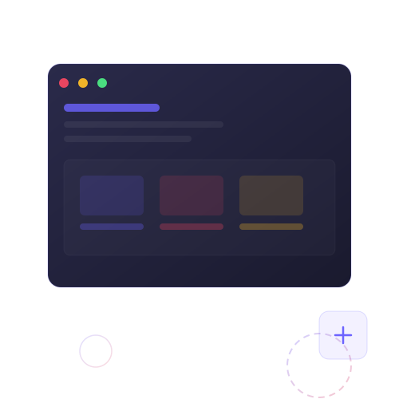

<div align="center">
  
  
  
  
</div>

<br>

<div align="center">
  <h1>✦ Web Works ✦</h1>
  <h3>Professional Web Development Portfolio</h3>
  <br>
  <a href="https://powerisvansh.github.io/portfolio-my/" target="_blank">
    
  </a>
  &nbsp;
  <a href="#features">
    
  </a>
</div>

<br>

---

> A fully responsive business portfolio website built with vanilla HTML, CSS, and JavaScript. Showcases real client projects, services, pricing plans, and a contact form — all with a polished, modern UX.

---

## ✨ Features

| | |
|---|---|
| ⚡ **Skeleton Loading** | Smooth preloader with animated skeleton screens |
| 🎨 **Project Filtering** | Filter portfolio by category (All, Web, E-Com, UI/UX, Branding) |
| 💬 **Testimonials Carousel** | Client reviews with star ratings — auto-rotates |
| 💰 **Pricing Plans** | 3-tier plans (Basic, Professional, Enterprise) with feature lists |
| ❓ **FAQ Accordion** | Smooth expand/collapse for common questions |
| 📱 **Fully Responsive** | Mobile-first, adapts to all screen sizes |
| 🧭 **Sticky Navbar** | Fixed header with active section highlighting |
| 🔢 **Animated Counters** | Stats counter animation on scroll (projects, clients, years) |
| 📬 **Contact Form** | Functional form with validation and WhatsApp redirect |
| 🎯 **Scroll Animations** | Elements fade in as you scroll |
| 🎠 **Process Slider** | Step-by-step workflow carousel |
| 🌙 **Clean UI** | Modern pastel-pink aesthetic with smooth transitions |

## 🛠 Tech Stack

```
├── HTML5          — Semantic structure & SEO meta tags  
├── CSS3           — Flexbox, Grid, animations, custom properties  
└── Vanilla JS     — DOM manipulation, Intersection Observer, carousels  
```

- **Fonts:** Inter (Google Fonts)  
- **Icons:** Font Awesome 6  
- **No frameworks** — Pure hand-crafted code

## 📂 Project Structure

```
portfolio-my/
├── index.html          # Main page
├── style.css           # All styles
├── script.js           # All functionality
├── images/
│   ├── hero.svg        # Hero illustration
│   ├── project1.svg    # Project thumbnails
│   ├── project2.svg
│   ├── project3.svg
│   ├── project4.svg
│   ├── project5.svg
│   └── project6.svg
└── README.md
```

## 🚀 Getting Started

```bash
# Clone the repo
git clone https://github.com/Powerisvansh/portfolio-my.git

# Open in browser
cd portfolio-my
start index.html
```

No build tools, no dependencies — just open and go.

## 📸 Preview

<div align="center">
  
</div>

## 🧠 What I Learned

- Building a full-featured SPA-style site with pure JS
- Intersection Observer API for scroll-triggered animations
- Skeleton screen preloading for perceived performance
- Responsive design patterns without any CSS framework

## 📬 Contact

<div align="center">
  <a href="https://powerisvansh.github.io/portfolio-my/" target="_blank">
    
  </a>
  &nbsp;
  <a href="mailto:hello@webworks.in">
    
  </a>
</div>

---

<div align="center">
  <sub>Built with ❤️ by <strong>Web Works</strong></sub>
</div>
